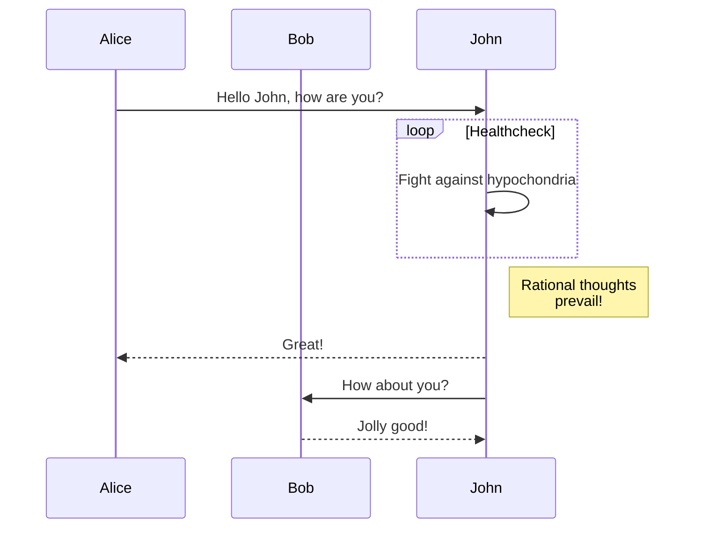

Markdown file basics
====================

[Markdown file syntax reference](https://www.markdownguide.org/basic-syntax)

tips
----
* Preview in VSCode: Control + Shift + V 

* How to draw diagrams in markdown - 
    - `mermaid` is my first one and I like it! 
    - Best part - it is natively suppoed in github
    - Reference:  https://mermaid-js.github.io/mermaid/#/
    - Example: 
        - Graph

Author: [Vijay Kundanagurthi](http://twitter.com/vijred)
